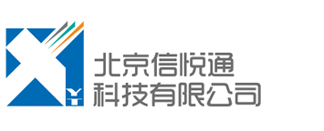

	

				
	
		
	<ul>
		<li><a href="1.html">企业通讯解决方案</a></li>
		<li><a href="2.html">呼叫中心解决方案</a></li>
		<li><a href="3.html">指挥调度解决方案</a></li>
		<li><a href="4.html">视频解决方案</a></li>
		<li class="selected"><a href="5.html">FreeSWITCH</a></li>
	</ul>

	

		<h1>FreeSWITCH 技术顾问及商业支持</h1>
		

			

				我们提供中英文的 FreeSWITCH (http://www.freeswitch.org) 开源软交换系统的支持与服务。
			

			

				我们有多年 FreeSWITCH 开发与使用经验。我们的工程师活跃于 FreeSWITCH 社区，多年来贡献了大量的的补丁和代码。
			

			

				我们提供客户咨询以及商业的技术支持合同，帮助你解决技术难题并维护您的 FreeSWITCH 平台。
			

			

				我们与官方 FreeSWITCH Solutions (http://www.freeswitchsolutions.com/) 的合作伙伴，确保客户能得到及时、深入、有力的技术支持。
			

		

		

			<h2>联系我们</h2>
			
<a href="mailto:info@x-y-t.com">info@x-y-t.com</a>

		

	

