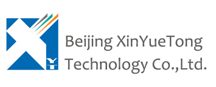

    

        <a href="/">中&nbsp;文</a>
    

    

        
    

    <ul>
        <li><a href="ippbx_en.html">Company PBX solutions</a></li>
        <li class="selected"><a href="callcenter_en.html">Call Center Solutions</a></li>
        <li><a href="commanding_dispatching_en.html">Dispatching Solutions</a></li>
        <li><a href="sip_video_en.html">Video Solutions</a></li>
        <li><a href="freeswitch_solutions_en.html">FreeSWITCH Consulting</a></li>
    </ul>

    

        <h1>Call Center Solutions</h1>
        

            

        Ocean Soft Switch Platform is a telecom level switching platform. It has all Call Center functions and it speaks SIP and also it can communicate with PSTN networks with TDM hardwares.
            

        

        

            <h2>Features:</h2>
            <ul>
                <li>- Based on Freeswitch and Linux, stable and reliable</li>
                <li>- Based on multi-threaded core, can scale from small office use to real telecom use</li>
                <li>- Rich codec support, G711, G722, G729, G723, Speex, gsm, iLBC, SILK, iSAC and more...</li>
                <li>- Flexiable deployment, all functions including recording can be on one server</li>
                <li>- Hi availability</li>
            </ul>
	    

        Ocean offers HTTP Rest API, websocket API and Linux/Windows SDK, damn easy to integrate into other systems such as CRM and OA. And, it does support Nexus CTI middleware.
	    

        

        

            <h2>Contact us for more information</h2>
            
<input readonly value="info@x-y-t.com"></input>

        

    

