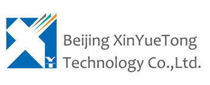

	

    

        <a href="/">中&nbsp;文</a>
    

    

        
    

    <ul>
        <li><a href="ippbx_en.html">Company PBX solutions</a></li>
        <li><a href="callcenter_en.html">Call Center Solutions</a></li>
        <li class="selected"><a href="commanding_dispatching_en.html">Dispatching Solutions</a></li>
        <li><a href="sip_video_en.html">Video Solutions</a></li>
        <li><a href="freeswitch_solutions_en.html">FreeSWITCH Consulting</a></li>
    </ul>

    

        <h1>Dispatching Solutions</h1>
        

            

		We offer advanced commanding & dispatching system which was designed to improve efficiency for produce factories such as coal industry, petroleum, steel works, electric power corporations and also specially designed to work on emergency conditions such as fire, earthquake etc.
            

            

		Our solution provides efficient and flexible communications mode, multi-level call control by it's top design and though our solid soft-switch system. The friendly user interface ensures it even more efficient and easier to use.
            

            

		And we offer API and SDK which enable system integrators to integrate it into any system with ease and with all the power of the system.
            

        

        

            <h2>Contact us for more information</h2>
            
<input readonly value="info@x-y-t.com"></input>

        

    

