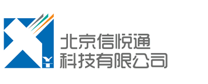

	

		
	
		
	<ul>
		<li class="selected"><a href="ippbx.html">企业通讯解决方案</a></li>
		<li><a href="callcenter.html">呼叫中心解决方案</a></li>
		<li><a href="commanding_dispatching.html">指挥调度解决方案</a></li>
		<li><a href="sip_video.html">视频解决方案</a></li>
		<li><a href="freeswitch_solutions.html">FreeSWITCH</a></li>
	</ul>

	

		<h1>企业通讯解决方案</h1>
		

			

				基于VoIP的企业通信解决方案可以方便、快捷地连结您的各分支机构。在享受低成本的企业通信的同时给您带来异想不到的新功能和新体验。
			

			

				通过OLA软交换平台，我们支持标准的SIP协议及开放的通信标准。系统运行稳定可靠，通过积木式叠加及分布式组网可以提供极佳的通信能力。
			

		

		

			<h2>联系我们</h2>
			
<a href="mailto:info@x-y-t.com">info@x-y-t.com</a>

		

	

